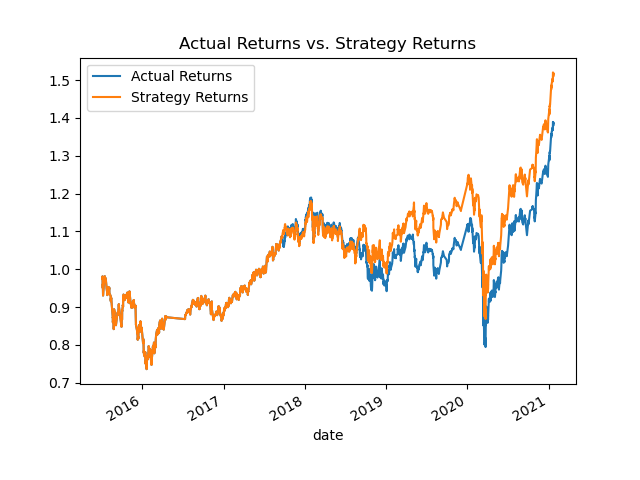
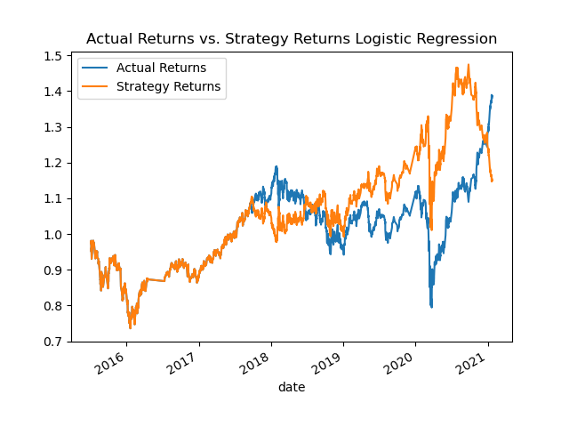

Challenge 14 CU Fintech
Andrew R. Bader

# Project Title

Robo Advisor

__

## Technologies

This project uses the Python with Jupyter notebook, pandas, pathlib, hvplot, matplotlib, sklearn, and dependencies from sklearn

___

## Installation Guide

To clone and use:
1) make a local directory for this github repository
2) clone down this repo with git clone command
3) cd into cloned repo
4) install depedencies pandas, numpy, pathlib, sklearn and hvplot
5) run in Jupyter notebook

---

## Contributor

Andrew Ryan Bader

---

## License

N/A

Evaluation Report:

From the strategy returns, we see an overall decrease in returns from 2016 on with a slight peak around 2020, a significant dip, then another slight peak mid 2020. We can see this in the plot below.

From the first model studying the actual versus strategy returns, we see that up until around 2019, the actual returns and strategy returns follow each other pretty much 1 to 1. From 2019 on, there is a slight divergence, however the trends remain fairly close for both lines.

From the logistic regression model, we see a bit more divergence between actual returns versus strategy returns. At 2018, we see the actual returns slightly peak as the strategy returns dip. These lines further diverge after 2019 with similar trends. However the strategy returns peak before the upward trend of the actual returns plot.

