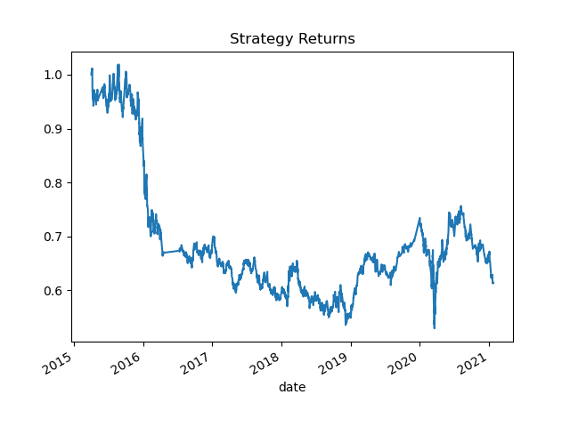

Challenge 14 CU Fintech
Andrew R. Bader

Evaluation Report:

From the strategy returns, we see an overall decrease in returns from 2016 on with a slight peak around 2020, a significant dip, then another slight peak mid 2020

